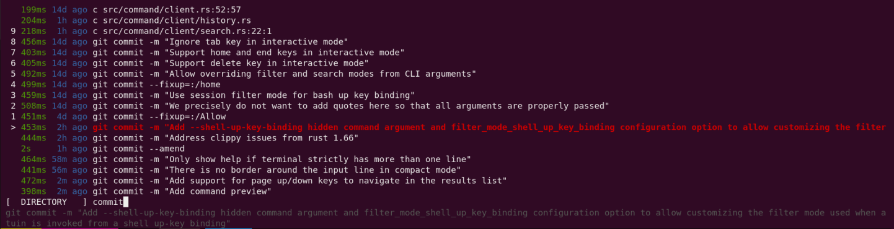

# Atuin Documentation


This repository contains the source code for the official Atuin documentation, hosted at [docs.atuin.sh](https://docs.atuin.sh).

Atuin is a **magical shell history** tool that replaces your shell's default history with a SQLite database, providing a powerful search interface and optional cloud synchronization.



## Project Structure

The documentation content is primarily written in Markdown (and MDX) and is located in the `src/content/docs` directory.

## Getting Started (Local Development)

To set up and run the documentation site locally, follow these steps:

1.  **Clone the repository:**
    ```bash
    git clone https://github.com/atuinsh/atuin-docs.git
    cd atuin-docs
    ```

2.  **Install dependencies:**
    ```bash
    npm install
    ```

3.  **Start the development server:**
    ```bash
    npm run dev
    ```
    This will start a local development server, usually accessible at `http://localhost:4321`. The site will automatically reload as you make changes to the source files.

## Contributing

We welcome contributions to improve the Atuin documentation! If you find an error, want to clarify a section, or add new content, please feel free to open an issue or submit a pull request.

Before contributing, please ensure your changes align with the existing documentation style and guidelines.
